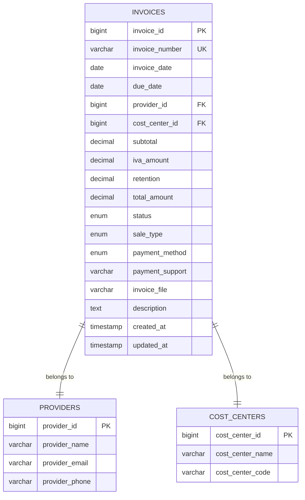

# 🗄️ Estructura de Base de Datos - Sistema de Facturas

## 📋 Índice
1. [Introducción](#introducción)
2. [Tabla Principal: invoices](#tabla-principal-invoices)
3. [Relaciones](#relaciones)
4. [Índices y Optimización](#índices-y-optimización)
5. [Migraciones](#migraciones)
6. [Diagrama de Relaciones](#diagrama-de-relaciones)
7. [Consultas de Ejemplo](#consultas-de-ejemplo)

---

## 🎯 Introducción

La estructura de la base de datos del sistema de facturas ha sido diseñada para soportar operaciones contables profesionales, con énfasis en la claridad, eficiencia y mantenibilidad.

### ✨ Características Principales
- ✅ **Estructura Contable**: Orden lógico de campos contables
- ✅ **Tipos de Venta**: Soporte para contado y crédito
- ✅ **Estados de Pago**: Control de pagos pendientes y pagados
- ✅ **Documentos**: Gestión de archivos de soporte
- ✅ **Relaciones**: Integración con proveedores y centros de costos
- ✅ **Optimización**: Índices para consultas eficientes

---

## 📊 Tabla Principal: invoices

### 🏗️ Estructura Completa

```sql
CREATE TABLE `invoices` (
  `invoice_id` bigint(20) unsigned NOT NULL AUTO_INCREMENT COMMENT 'ID único de la factura',
  `invoice_number` varchar(255) NOT NULL COMMENT 'Número de factura',
  `invoice_date` date NOT NULL COMMENT 'Fecha de emisión de la factura',
  `due_date` date NOT NULL COMMENT 'Fecha de vencimiento de la factura',
  `provider_id` bigint(20) unsigned NOT NULL COMMENT 'ID del proveedor que emitió la factura',
  `cost_center_id` bigint(20) unsigned NOT NULL COMMENT 'ID del centro de costos asociado',
  `subtotal` decimal(15,2) NULL COMMENT 'Subtotal antes de impuestos',
  `iva_amount` decimal(15,2) NULL COMMENT 'Valor del IVA (19% del subtotal)',
  `retention` decimal(15,2) NULL COMMENT 'Retención en la fuente',
  `total_amount` decimal(15,2) NOT NULL COMMENT 'Total a pagar (subtotal + IVA - retención)',
  `status` enum('PENDIENTE','PAGADA') NOT NULL DEFAULT 'PENDIENTE' COMMENT 'Estado de pago de la factura',
  `sale_type` enum('CONTADO','CREDITO') NOT NULL DEFAULT 'CONTADO' COMMENT 'Tipo de venta: CONTADO o CREDITO',
  `payment_method` enum('EFECTIVO','TRANSFERENCIA','CHEQUE','TARJETA','OTRO') NULL COMMENT 'Método de pago utilizado',
  `payment_support` varchar(255) NULL COMMENT 'Archivo de soporte de pago (PDF/imagen)',
  `invoice_file` varchar(255) NULL COMMENT 'Archivo de la factura (PDF/imagen)',
  `description` text NULL COMMENT 'Descripción o notas adicionales',
  `created_at` timestamp NULL DEFAULT CURRENT_TIMESTAMP COMMENT 'Fecha de creación',
  `updated_at` timestamp NULL DEFAULT CURRENT_TIMESTAMP ON UPDATE CURRENT_TIMESTAMP COMMENT 'Fecha de actualización',
  PRIMARY KEY (`invoice_id`),
  UNIQUE KEY `invoices_invoice_number_unique` (`invoice_number`),
  KEY `invoices_provider_id_foreign` (`provider_id`),
  KEY `invoices_cost_center_id_foreign` (`cost_center_id`),
  KEY `invoices_status_index` (`status`),
  KEY `invoices_sale_type_index` (`sale_type`),
  KEY `invoices_invoice_date_index` (`invoice_date`),
  KEY `invoices_due_date_index` (`due_date`),
  KEY `invoices_total_amount_index` (`total_amount`),
  KEY `invoices_payment_method_index` (`payment_method`),
  CONSTRAINT `invoices_provider_id_foreign` FOREIGN KEY (`provider_id`) REFERENCES `providers` (`provider_id`) ON DELETE CASCADE,
  CONSTRAINT `invoices_cost_center_id_foreign` FOREIGN KEY (`cost_center_id`) REFERENCES `cost_centers` (`cost_center_id`) ON DELETE CASCADE
) ENGINE=InnoDB DEFAULT CHARSET=utf8mb4 COLLATE=utf8mb4_unicode_ci;
```

### 📋 Descripción de Campos

#### 🔑 Campos de Identificación
| Campo | Tipo | Descripción | Restricciones |
|-------|------|-------------|---------------|
| `invoice_id` | BIGINT | ID único de la factura | PRIMARY KEY, AUTO_INCREMENT |
| `invoice_number` | VARCHAR(255) | Número de factura | NOT NULL, UNIQUE |

#### 📅 Campos de Fechas
| Campo | Tipo | Descripción | Restricciones |
|-------|------|-------------|---------------|
| `invoice_date` | DATE | Fecha de emisión | NOT NULL |
| `due_date` | DATE | Fecha de vencimiento | NOT NULL |

#### 🏢 Campos de Relaciones
| Campo | Tipo | Descripción | Restricciones |
|-------|------|-------------|---------------|
| `provider_id` | BIGINT | ID del proveedor | NOT NULL, FOREIGN KEY |
| `cost_center_id` | BIGINT | ID del centro de costos | NOT NULL, FOREIGN KEY |

#### 💰 Campos Contables
| Campo | Tipo | Descripción | Restricciones |
|-------|------|-------------|---------------|
| `subtotal` | DECIMAL(15,2) | Subtotal antes de impuestos | NULL |
| `iva_amount` | DECIMAL(15,2) | Valor del IVA (19%) | NULL |
| `retention` | DECIMAL(15,2) | Retención en la fuente | NULL |
| `total_amount` | DECIMAL(15,2) | Total a pagar | NOT NULL |

#### 🏷️ Campos de Estado
| Campo | Tipo | Descripción | Restricciones |
|-------|------|-------------|---------------|
| `status` | ENUM | Estado de pago | 'PENDIENTE', 'PAGADA' |
| `sale_type` | ENUM | Tipo de venta | 'CONTADO', 'CREDITO' |

#### 💳 Campos de Pago
| Campo | Tipo | Descripción | Restricciones |
|-------|------|-------------|---------------|
| `payment_method` | ENUM | Método de pago | EFECTIVO, TRANSFERENCIA, CHEQUE, TARJETA, OTRO |
| `payment_support` | VARCHAR(255) | Soporte de pago | NULL |

#### 📄 Campos de Documentos
| Campo | Tipo | Descripción | Restricciones |
|-------|------|-------------|---------------|
| `invoice_file` | VARCHAR(255) | Archivo de factura | NULL |
| `description` | TEXT | Descripción | NULL |

#### ⏰ Campos de Metadatos
| Campo | Tipo | Descripción | Restricciones |
|-------|------|-------------|---------------|
| `created_at` | TIMESTAMP | Fecha de creación | DEFAULT CURRENT_TIMESTAMP |
| `updated_at` | TIMESTAMP | Fecha de actualización | ON UPDATE CURRENT_TIMESTAMP |

---

## 🔗 Relaciones

### 🏢 Relación con Proveedores

```sql
-- Tabla: providers
CREATE TABLE `providers` (
  `provider_id` bigint(20) unsigned NOT NULL AUTO_INCREMENT,
  `provider_name` varchar(255) NOT NULL,
  `provider_email` varchar(255) NULL,
  `provider_phone` varchar(255) NULL,
  -- otros campos...
  PRIMARY KEY (`provider_id`)
);

-- Relación: invoices.provider_id -> providers.provider_id
ALTER TABLE `invoices` 
ADD CONSTRAINT `invoices_provider_id_foreign` 
FOREIGN KEY (`provider_id`) REFERENCES `providers` (`provider_id`) 
ON DELETE CASCADE;
```

**Tipo de Relación**: One-to-Many (Un proveedor puede tener muchas facturas)

### 🏢 Relación con Centros de Costos

```sql
-- Tabla: cost_centers
CREATE TABLE `cost_centers` (
  `cost_center_id` bigint(20) unsigned NOT NULL AUTO_INCREMENT,
  `cost_center_name` varchar(255) NOT NULL,
  `cost_center_code` varchar(50) NULL,
  -- otros campos...
  PRIMARY KEY (`cost_center_id`)
);

-- Relación: invoices.cost_center_id -> cost_centers.cost_center_id
ALTER TABLE `invoices` 
ADD CONSTRAINT `invoices_cost_center_id_foreign` 
FOREIGN KEY (`cost_center_id`) REFERENCES `cost_centers` (`cost_center_id`) 
ON DELETE CASCADE;
```

**Tipo de Relación**: One-to-Many (Un centro de costos puede tener muchas facturas)

---

## 🚀 Índices y Optimización

### 📊 Índices Principales

#### 🔑 Índice Primario
```sql
PRIMARY KEY (`invoice_id`)
```

#### 🔍 Índices Únicos
```sql
UNIQUE KEY `invoices_invoice_number_unique` (`invoice_number`)
```

#### 🏢 Índices de Relaciones
```sql
KEY `invoices_provider_id_foreign` (`provider_id`)
KEY `invoices_cost_center_id_foreign` (`cost_center_id`)
```

#### 🏷️ Índices de Estado
```sql
KEY `invoices_status_index` (`status`)
KEY `invoices_sale_type_index` (`sale_type`)
```

#### 📅 Índices de Fechas
```sql
KEY `invoices_invoice_date_index` (`invoice_date`)
KEY `invoices_due_date_index` (`due_date`)
```

#### 💰 Índices Contables
```sql
KEY `invoices_total_amount_index` (`total_amount`)
```

#### 💳 Índices de Pago
```sql
KEY `invoices_payment_method_index` (`payment_method`)
```

### 🎯 Índices Compuestos Recomendados

#### Para Consultas de Vencimiento
```sql
-- Facturas vencidas por tipo
CREATE INDEX `idx_invoices_overdue` 
ON `invoices` (`status`, `due_date`, `sale_type`);

-- Facturas por período y estado
CREATE INDEX `idx_invoices_period_status` 
ON `invoices` (`invoice_date`, `status`, `sale_type`);
```

#### Para Reportes Contables
```sql
-- Reportes por proveedor y período
CREATE INDEX `idx_invoices_provider_period` 
ON `invoices` (`provider_id`, `invoice_date`, `total_amount`);

-- Reportes por centro de costos
CREATE INDEX `idx_invoices_cost_center_period` 
ON `invoices` (`cost_center_id`, `invoice_date`, `sale_type`);
```

---

## 📁 Migraciones

### 🗂️ Archivos de Migración

#### 1. **Migración Principal**
```
database/migrations/2025_10_06_055806_add_new_columns_to_invoices_table.php
```
**Propósito**: Agregar nuevas columnas contables
- `subtotal`
- `iva_amount`
- `retention`
- `payment_method`
- `payment_support`
- `invoice_file`

#### 2. **Migración de Documentación**
```
database/migrations/2025_10_06_060153_reorder_invoices_table_columns.php
```
**Propósito**: Agregar comentarios a las columnas

#### 3. **Migración de Reordenamiento**
```
database/migrations/2025_10_06_060451_reorder_invoices_columns_physically.php
```
**Propósito**: Reordenar columnas físicamente

#### 4. **Migración de Tipos de Venta**
```
database/migrations/2025_10_06_060851_add_sale_type_to_invoices_table.php
```
**Propósito**: Agregar campo `sale_type` y migrar datos existentes

### 🔄 Orden de Ejecución

```bash
# Ejecutar migraciones en orden
php artisan migrate --path=database/migrations/2025_10_06_055806_add_new_columns_to_invoices_table.php
php artisan migrate --path=database/migrations/2025_10_06_060153_reorder_invoices_table_columns.php
php artisan migrate --path=database/migrations/2025_10_06_060451_reorder_invoices_columns_physically.php
php artisan migrate --path=database/migrations/2025_10_06_060851_add_sale_type_to_invoices_table.php
```

---

## 📊 Diagrama de Relaciones



---

## 🔍 Consultas de Ejemplo

### 📊 Consultas Básicas

#### Obtener Todas las Facturas
```sql
SELECT * FROM invoices;
```

#### Facturas Pendientes
```sql
SELECT * FROM invoices WHERE status = 'PENDIENTE';
```

#### Facturas Vencidas
```sql
SELECT * FROM invoices 
WHERE status = 'PENDIENTE' 
AND due_date < CURDATE();
```

### 💰 Consultas Contables

#### Ventas por Tipo
```sql
-- Ventas de contado
SELECT COUNT(*), SUM(total_amount) 
FROM invoices 
WHERE sale_type = 'CONTADO';

-- Ventas a crédito
SELECT COUNT(*), SUM(total_amount) 
FROM invoices 
WHERE sale_type = 'CREDITO';
```

#### Reporte Mensual
```sql
SELECT 
    sale_type,
    status,
    COUNT(*) as cantidad,
    SUM(total_amount) as total
FROM invoices 
WHERE MONTH(invoice_date) = 1 
AND YEAR(invoice_date) = 2024
GROUP BY sale_type, status;
```

### 🏢 Consultas con Relaciones

#### Facturas con Información del Proveedor
```sql
SELECT 
    i.invoice_number,
    i.total_amount,
    i.status,
    p.provider_name
FROM invoices i
JOIN providers p ON i.provider_id = p.provider_id
WHERE i.status = 'PENDIENTE';
```

#### Facturas por Centro de Costos
```sql
SELECT 
    cc.cost_center_name,
    COUNT(*) as cantidad_facturas,
    SUM(i.total_amount) as total_monto
FROM invoices i
JOIN cost_centers cc ON i.cost_center_id = cc.cost_center_id
GROUP BY cc.cost_center_id, cc.cost_center_name;
```

### 📈 Consultas de Análisis

#### Top 5 Proveedores por Monto
```sql
SELECT 
    p.provider_name,
    COUNT(*) as cantidad,
    SUM(i.total_amount) as total_monto
FROM invoices i
JOIN providers p ON i.provider_id = p.provider_id
GROUP BY p.provider_id, p.provider_name
ORDER BY total_monto DESC
LIMIT 5;
```

#### Análisis de Vencimientos
```sql
SELECT 
    CASE 
        WHEN due_date < CURDATE() THEN 'Vencidas'
        WHEN due_date <= DATE_ADD(CURDATE(), INTERVAL 7 DAY) THEN 'Próximas a vencer'
        ELSE 'Vigentes'
    END as estado_vencimiento,
    COUNT(*) as cantidad,
    SUM(total_amount) as total_monto
FROM invoices 
WHERE status = 'PENDIENTE'
GROUP BY estado_vencimiento;
```

---

## 📚 Mejores Prácticas

### ✅ Recomendaciones de Diseño

1. **Usar tipos de datos apropiados**
   - DECIMAL para montos monetarios
   - ENUM para valores fijos
   - TIMESTAMP para fechas automáticas

2. **Establecer restricciones apropiadas**
   - NOT NULL para campos obligatorios
   - UNIQUE para campos únicos
   - FOREIGN KEY para integridad referencial

3. **Crear índices estratégicos**
   - Índices en campos de filtrado frecuente
   - Índices compuestos para consultas complejas
   - Índices únicos para campos únicos

### ⚠️ Consideraciones de Performance

1. **Índices**: Crear índices en campos filtrados frecuentemente
2. **Consultas**: Usar LIMIT para grandes volúmenes
3. **Relaciones**: Cargar solo las relaciones necesarias
4. **Caché**: Implementar caché para consultas repetitivas

### 🔧 Mantenimiento

1. **Backup regular** de la base de datos
2. **Monitoreo de performance** de consultas
3. **Actualización de estadísticas** de índices
4. **Limpieza periódica** de datos obsoletos

---

*Estructura de Base de Datos - Sistema de Facturas v2.0*
